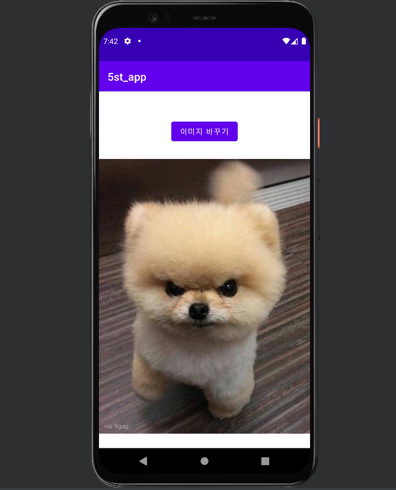
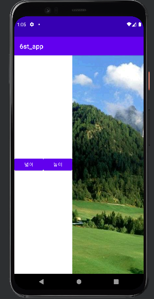
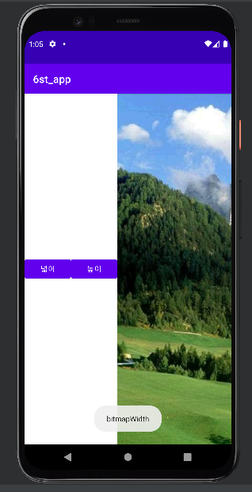
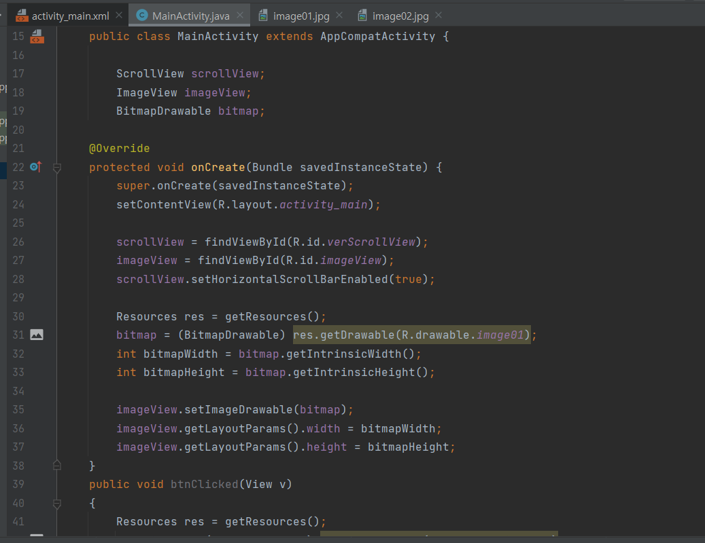
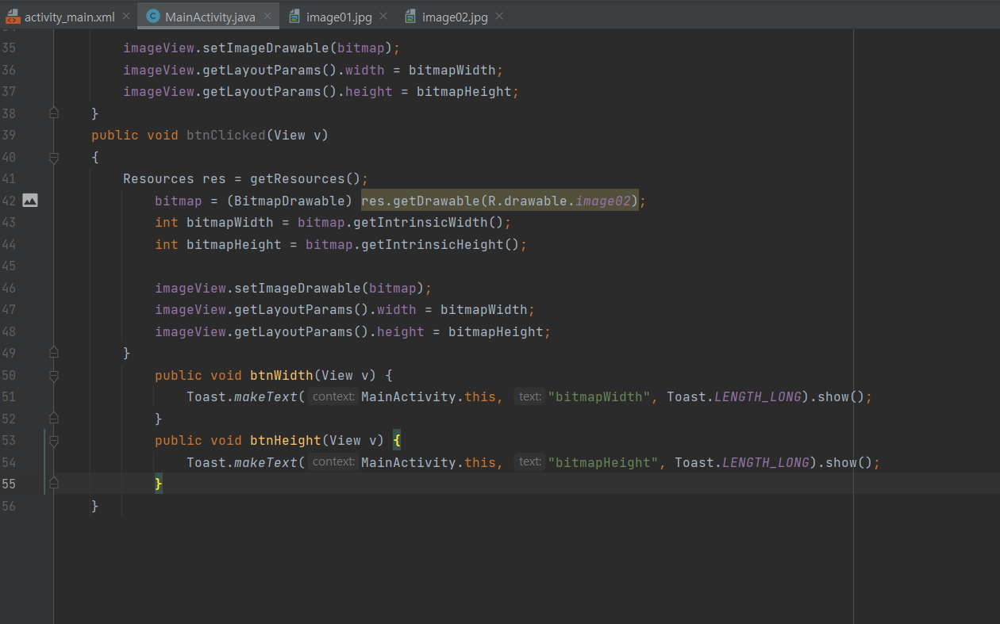
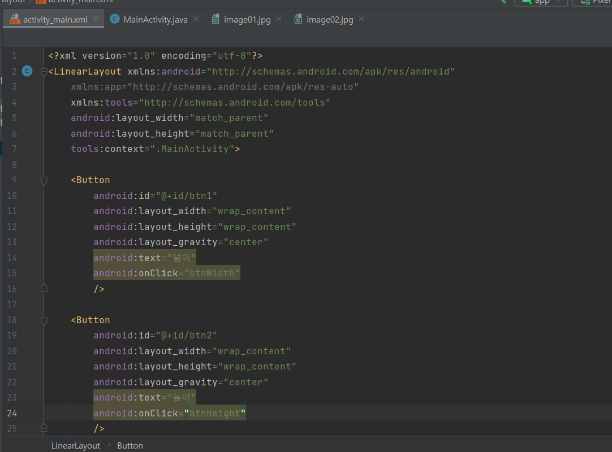

# 2주차 (2022-03-15)
- 안드로이드 스튜디오 설치 & 깃허브 가입 및 저장소 생성
</img>

# 3주차 (2022-03-22)
</img>
</img>
</img>

# 4주차 (2022-03-29) 코로나로 인한 결석

# 5주차 (2022-04-05)
- 이미지 바꾸기 & 소스코드

</img>
</img>
</img>
</img>

# 6주차 (2022-04-12)
- 두개의 버튼을 추가 삽입 
• 한 개의 버튼을 클릭하면 
    1. Toast.makeText() 이용 하단에 width 크기 값을 표시 (Interger.toString() 함수 사용) 
• 또 다른 버튼을 클릭하면 
    2. Toast.makeText() 하단에 height 크기 값을 표시 (Interger.toString() 함수 사용)
    
    
</img>
</img>
</img>
</img>
</img>
