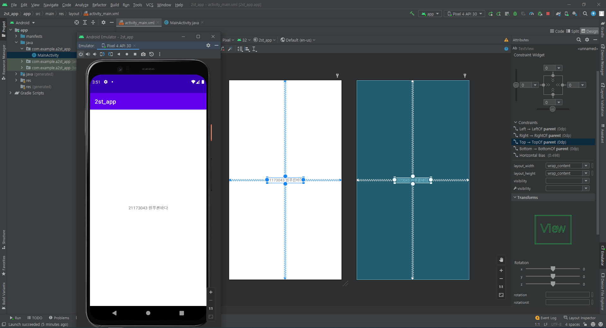
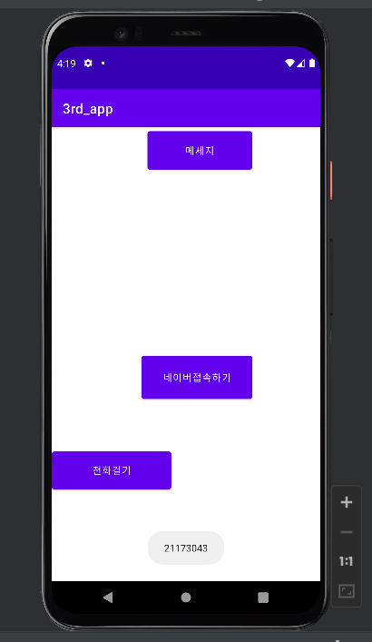

# 2주차 (2022-03-15)
- 안드로이드 스튜디오 설치 & 깃허브 가입 및 저장소 생성
</img>

# 3주차 (2022-03-22)
</img>
</img>
</img>

# 4주차 (2022-03-29) 의심 증상으로 인한 코로나 검사로 결석 (양성 나옴)

# 5주차 (2022-04-05)
- 이미지 바꾸기 & 소스코드

</img>
</img>
</img>
</img>

# 6주차 (2022-04-12)
- 두개의 버튼을 추가 삽입 
• 한 개의 버튼을 클릭하면 
    1. Toast.makeText() 이용 하단에 width 크기 값을 표시 (Interger.toString() 함수 사용) 
• 또 다른 버튼을 클릭하면 
    2. Toast.makeText() 하단에 height 크기 값을 표시 (Interger.toString() 함수 사용)
    
    
</img>
</img>
</img>
</img>
</img>

# 9주차 (2022-05-03)
- SMS 입력화면 만들고 글자 수 표시하기

</img>
</img>
</img>
</img>
</img>
</img>

# 10주차 (2022-05-03)
</img>
</img>
</img>
</img>
</img>

# 11주차 (2022-05-17)
- 안드로이드 앱 만들기 <웹으로 요청하기>
</img>
</img>
</img>
</img>
</img>

# 2학기 5주차 (2022-09-27)
- 프레임레이아웃과 뷰의 전환

</img>
</img>
</img>
</img>
</img>
</img>
